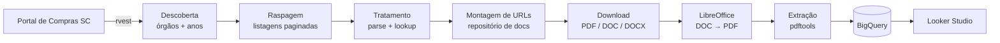

# BIEL — Robô Buscador de Informações em Editais de Licitação

[](https://www.r-project.org/)
[](LICENSE)
[](https://doi.org/10.5539/par.v13n2p52)
[](#)
[](https://cloud.google.com/bigquery)
[](https://lookerstudio.google.com/)

> **BIEL** é um pipeline em R que monitora o Portal de Compras do Estado de
> Santa Catarina, raspa metadados e o conteúdo integral de editais de
> licitação, e materializa tudo em uma base estruturada no Google BigQuery
> consumida por um painel no Looker Studio.

O objetivo é **democratizar o acesso à informação sobre compras públicas**:
pequenas e médias empresas costumam perder oportunidades não por falta de
competitividade, mas por não conseguir acompanhar manualmente os portais de
governo. O BIEL automatiza esse monitoramento e transforma dados dispersos em
uma base consultável e pronta para análise.

---

## 📑 Publicação acadêmica

Este projeto deu origem ao artigo
**"Data Science in Promoting the Participation of SMEs in Public Biddings:
The Case of BIEL"**, publicado em *Public Administration Research*, v. 13,
n. 2, 2024 — DOI: [10.5539/par.v13n2p52](https://doi.org/10.5539/par.v13n2p52).

---

## 🔭 Arquitetura



| Etapa | Função principal | Responsabilidade |
|---|---|---|
| Descoberta | `scrape_orgaos_from_portal()` | Lista órgãos e anos disponíveis |
| Raspagem  | `scrape_editais_do_ano()` | Pagina por pagina, coleta parâmetros e tabela |
| Tratamento | `parse_parametros()` + `attach_orgao_by_cdo()` | Normaliza colunas, junta lookup canônica |
| URLs | `attach_links_editais()` | Constrói links finais com retry e backoff |
| Download | `download_editais()` | Baixa PDFs/DOCs, retoma de onde parou |
| Conteúdo | `attach_conteudo_editais()` | Extrai texto via `pdftools` |
| Carga | `upload_para_bigquery()` | Persiste no BigQuery (overwrite controlado) |

---

## 🚀 Destaques técnicos

- **Modular e testável.** O monolito original de 730 linhas foi quebrado em
  módulos coesos com responsabilidade única (`R/*.R`).
- **Idempotência.** O download verifica o que já está em disco antes de
  baixar — execuções podem ser interrompidas e retomadas sem perda.
- **Retry com backoff exponencial** nas raspagens e downloads, para tolerar
  instabilidade do portal alvo.
- **Configuração externalizada** em `config/config.local.yml` —
  zero segredos no código, zero caminhos hardcoded.
- **Lookup canônica em CSV** (`data-raw/orgaos.csv`) substituindo ~150
  linhas duplicadas de `case_when`.
- **Reprodutibilidade** via `DESCRIPTION` + `renv` (opcional).
- **CI** com lint + style check via GitHub Actions.

---

## 📁 Estrutura do repositório

```
BIEL-EDITAIS-SC-LOOKER/
├── R/                          # Funções modulares do pipeline
│   ├── setup.R                 # Carregamento de pacotes
│   ├── config.R                # Loader/validador de YAML
│   ├── lookup_orgaos.R         # Lookup CSV ↔ código de órgão
│   ├── scrape_orgaos.R         # Raspagem inicial do portal
│   ├── scrape_editais.R        # Raspagem paginada de editais
│   ├── build_links.R           # Construção das URLs de download
│   ├── download_editais.R      # Download idempotente + retry
│   ├── read_pdfs.R             # Extração de texto via pdftools
│   ├── upload_bigquery.R       # Autenticação + carga no BQ
│   └── consolidate.R           # Consolidação mensal das bases .rds
├── scripts/
│   ├── run_pipeline.R          # Orquestrador principal
│   ├── consolida_base.R        # CLI: junta .rds mensais → CSV
│   └── doc_to_pdf.sh           # Conversão DOC/DOCX → PDF (LibreOffice)
├── data-raw/
│   ├── orgaos.csv              # 73 órgãos (cdo, sigla, nome)
│   └── lista_situacoes.txt     # Status possíveis de um edital
├── config/
│   └── config.example.yml      # Template de configuração
├── .github/workflows/
│   └── lint.yml                # CI: lintr + styler
├── DESCRIPTION                 # Metadados + dependências
├── CHANGELOG.md
├── LICENSE                     # MIT
└── README.md
```

---

## ⚙️ Pré-requisitos

- **R ≥ 4.1** (e, opcionalmente, RStudio)
- **LibreOffice** instalado (necessário apenas se houver editais em DOC/DOCX)
- **Google Cloud** com BigQuery habilitado e uma conta de serviço com
  permissão de escrita

---

## 🛠️ Setup

```bash
# 1. Clone e entre no diretório
git clone https://github.com/tenorioabsgit/BIEL-EDITAIS-SC-LOOKER.git
cd BIEL-EDITAIS-SC-LOOKER

# 2. (Recomendado) inicialize o renv para isolar dependências
Rscript -e 'install.packages("renv"); renv::init()'

# 3. Copie e edite a configuração local
cp config/config.example.yml config/config.local.yml
$EDITOR config/config.local.yml
```

Os pacotes serão instalados automaticamente na primeira execução
(`R/setup.R::ensure_packages()`), mas você também pode pré-instalá-los:

```r
install.packages(c(
  "bigrquery", "rvest", "tidyverse", "xml2", "splitstackshape",
  "janitor", "fs", "plyr", "DBI", "httr", "pdftools",
  "readxl", "yaml"
))
```

---

## 🔐 Credenciais

> **Nunca versione chaves de acesso.** O `.gitignore` já bloqueia
> `credentials/`, `*-key.json`, `*service-account*.json` e variantes.

1. Crie um projeto no Google Cloud e uma chave de conta de serviço com
   permissão no BigQuery.
2. Salve o `.json` em `credentials/bigquery.json`.
3. Em `config/config.local.yml`, defina:

```yaml
bigquery:
  email:    seu-email@exemplo.com
  key_path: credentials/bigquery.json
  project:  seu-projeto-gcp
  dataset:  projeto_dou_sc
  table:    tabela_dou_sc
```

---

## ▶️ Como executar

```r
# Pipeline completo (descoberta → carga)
source("scripts/run_pipeline.R")
```

```bash
# Consolida bases mensais .rds em um único CSV
Rscript scripts/consolida_base.R ./backup_bases 04-2024

# Converte DOCs baixados para PDF (Linux/macOS, requer LibreOffice)
./scripts/doc_to_pdf.sh ./arquivos_downloaded
```

---

## 🩺 Troubleshooting

| Sintoma | Causa provável | O que checar |
|---|---|---|
| `cdo` aparece como `Outros` | Sigla do órgão fora do lookup | Adicionar entrada em `data-raw/orgaos.csv` |
| Download para no meio | Instabilidade do portal | Rode novamente — o pipeline retoma de onde parou |
| `bq_auth` pede login interativo | Caminho da chave incorreto | Conferir `bigquery.key_path` no YAML |
| Conteúdo do edital vazio | PDF é uma imagem | Não há OCR no pipeline — esperado |

---

## 👤 Autor

**José Tenório ABS Junior** — Líder de Dados & IA
[LinkedIn](https://www.linkedin.com/in/jose-tenorio-abs-junior/) ·
[GitHub](https://github.com/tenorioabsgit)

---

## 📜 Licença

Distribuído sob a [Licença MIT](LICENSE).
